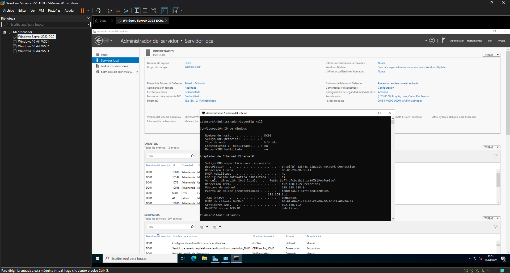
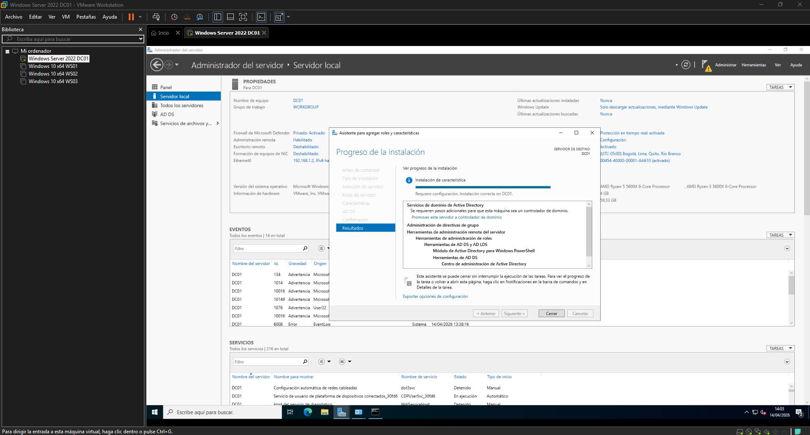
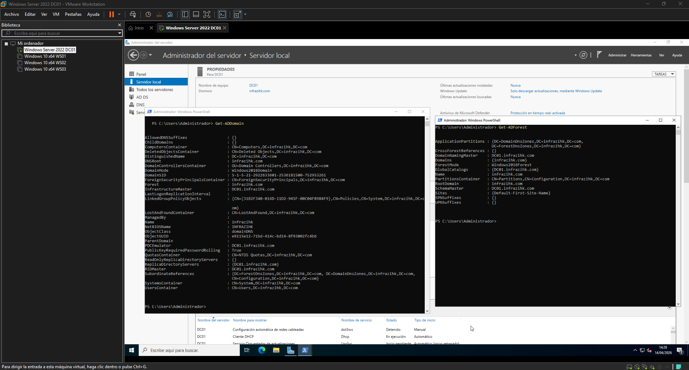
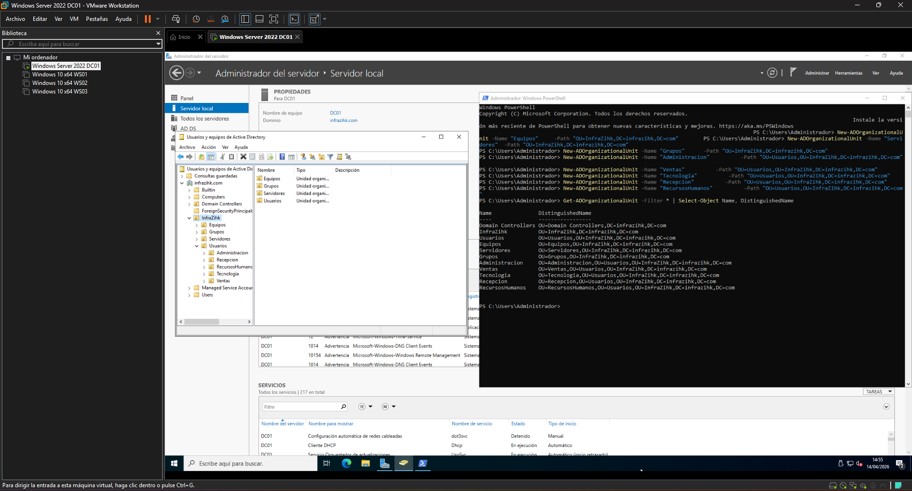
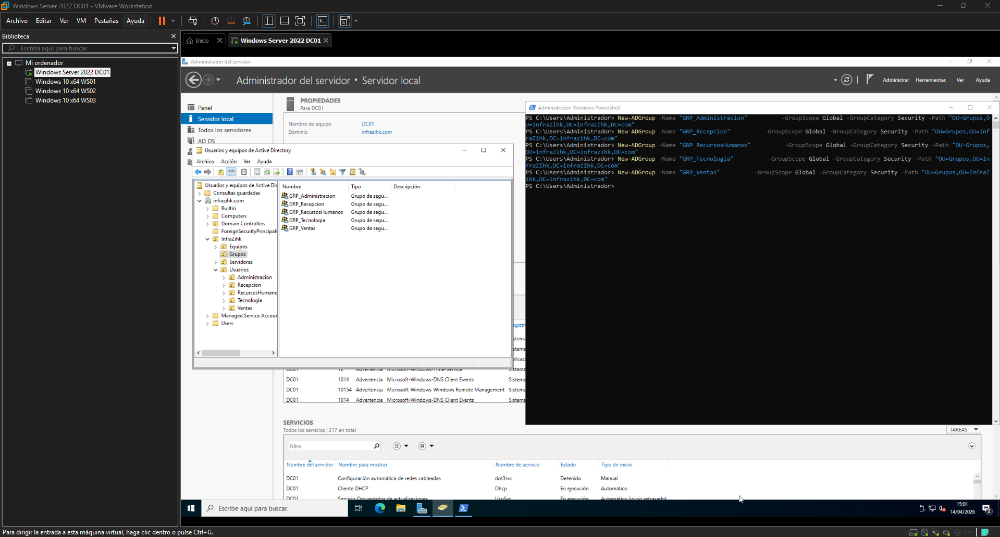
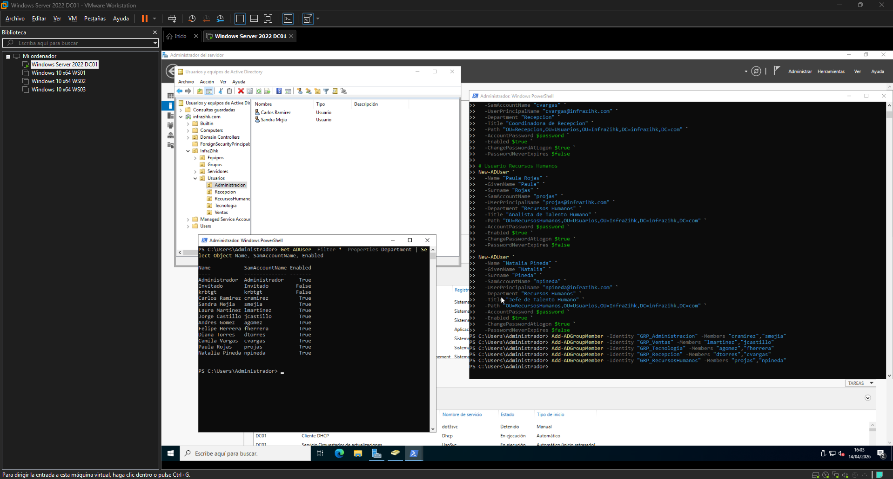
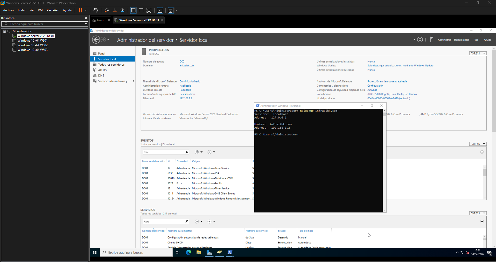

# Fase 1 Instalación y promoción de AD DS

## Objetivo

Levantar el primer controlador de dominio del dominio `infrazihk.com`, configurar la estructura base de Active Directory (OUs, usuarios y grupos) y dejarlo listo para las fases siguientes.

---

## Prerrequisitos

Antes de iniciar esta fase se asume que:

- VMware Workstation está instalado y operativo
- La VM de DC01 tiene Windows Server 2022 instalado (instalación mínima con GUI)
- La VM está en red interna con las demás máquinas del laboratorio

---

## Paso 1 Configurar IP estática y hostname en DC01

> Un Controlador de dominio necesita una IP fija. Si la IP cambia, el DNS y la replicación se rompen.

### 1.1 Cambiar el hostname

1. Clic derecho en **Inicio → Sistema**
2. Clic en **Renombrar este PC**
3. Escribir `DC01` y reiniciar cuando se solicite

### 1.2 Asignar IP estática

1. Ir a **Panel de Control → Redes e Internet → Centro de redes y recursos compartidos → Cambiar configuración del adaptador**
2. Clic derecho en el adaptador → **Propiedades**
3. Seleccionar **Protocolo de Internet versión 4 (TCP/IPv4)** → **Propiedades**
4. Configurar:

| Campo             | Valor               |
| ----------------- | ------------------- |
| Dirección IP      | `192.168.1.2`       |
| Máscara de subred | `255.255.255.0`     |
| Puerta de enlace  | `192.168.1.1`       |
| DNS preferido     | `192.168.1.2`       |
| DNS alternativo   | _(vacío por ahora)_ |

> DC01 apunta a sí mismo como DNS porque él mismo será el servidor DNS del dominio.

**Verificación:**

```powershell
ipconfig /all
```

Confirmar que la IP, máscara y DNS son los correctos.



---

## Paso 2 Instalar el rol AD DS

### 2.1 Desde el Administrador del servidor

1. Abrir el **Administrador del servidor**
2. Clic en **Administrar → Agregar roles y características**
3. Tipo de instalación: **Instalación basada en características o en roles**
4. Servidor destino: `DC01` e Ip `192.168.1.2`
5. En **Roles de servidor**, marcar **Servicios de dominio de Active Directory**
6. Aceptar las características adicionales requeridas
7. Avanzar hasta **Instalar**

### 2.2 Desde PowerShell (alternativa)

```powershell
Install-WindowsFeature -Name AD-Domain-Services -IncludeManagementTools
```



---

## Paso 3 Promover DC01 a Controlador de dominio

Este paso crea el dominio `infrazihk.com` desde cero.

### 3.1 Desde el Administrador del servidor

1. En la barra superior del Administrador del servidor, clic en la **bandera amarilla con advertencia**
2. Seleccionar **Promover este servidor a controlador de dominio**
3. En el wizard:
   - **Configuración de implementación:** Agregar un nuevo bosque
   - **Nombre de dominio raíz:** `infrazihk.com`
4. **Opciones del controlador de dominio:**
   - Nivel funcional del bosque: `Windows Server 2016`
   - Nivel funcional del dominio: `Windows Server 2016`
   - Dejar marcado: Servidor de Sistema de nombres de dominio (`DNS`) y Catálogo Global
   - Establecer la **contraseña DSRM** (guardarla ya que es crítica para recuperación)
5. **Opciones de DNS:** ignorar advertencia sobre delegación
6. **Rutas de acceso:** dejar los valores por defecto
7. Revisar resumen y clic en **Instalar**

El servidor se reiniciará automáticamente al finalizar.

### 3.2 Desde PowerShell (alternativa)

```powershell
Install-ADDSForest `
  -DomainName "infrazihk.com" `
  -DomainNetbiosName "INFRAZIHK" `
  -ForestMode "WinThreshold" `
  -DomainMode "WinThreshold" `
  -InstallDns:$true `
  -Force:$true
```

**Verificación post-reinicio:**

```powershell
Get-ADDomain
Get-ADForest
```



---

## Paso 4 Crear estructura de OUs

Las Organizational Units permiten aplicar GPOs y delegar administración por área.

```powershell
# OU raíz de la organización
New-ADOrganizationalUnit -Name "InfraZihk" -Path "DC=infrazihk,DC=com"

# Sub-OUs por categoría
New-ADOrganizationalUnit -Name "Usuarios"    -Path "OU=InfraZihk,DC=infrazihk,DC=com"
New-ADOrganizationalUnit -Name "Equipos"     -Path "OU=InfraZihk,DC=infrazihk,DC=com"
New-ADOrganizationalUnit -Name "Servidores"  -Path "OU=InfraZihk,DC=infrazihk,DC=com"
New-ADOrganizationalUnit -Name "Grupos"      -Path "OU=InfraZihk,DC=infrazihk,DC=com"

# Sub-OUs de Usuarios por departamento
New-ADOrganizationalUnit -Name "Administracion" -Path "OU=Usuarios,OU=InfraZihk,DC=infrazihk,DC=com"
New-ADOrganizationalUnit -Name "Ventas" -Path "OU=Usuarios,OU=InfraZihk,DC=infrazihk,DC=com"
New-ADOrganizationalUnit -Name "Tecnologia" -Path "OU=Usuarios,OU=InfraZihk,DC=infrazihk,DC=com"
New-ADOrganizationalUnit -Name "Recepcion"  -Path "OU=Usuarios,OU=InfraZihk,DC=infrazihk,DC=com"
New-ADOrganizationalUnit -Name "RecursosHumanos"  -Path "OU=Usuarios,OU=InfraZihk,DC=infrazihk,DC=com"
```

**Verificación:**

```powershell
Get-ADOrganizationalUnit -Filter * | Select-Object Name, DistinguishedName
```



---

## Paso 5 Crear grupos de seguridad

```powershell
New-ADGroup -Name "GRP_Administracion"  -GroupScope Global -GroupCategory Security -Path "OU=Grupos,OU=InfraZihk,DC=infrazihk,DC=com"
New-ADGroup -Name "GRP_Ventas" -GroupScope Global -GroupCategory Security -Path "OU=Grupos,OU=InfraZihk,DC=infrazihk,DC=com"
New-ADGroup -Name "GRP_Tecnologia" -GroupScope Global -GroupCategory Security -Path "OU=Grupos,OU=InfraZihk,DC=infrazihk,DC=com"
New-ADGroup -Name "GRP_Recepcion" -GroupScope Global -GroupCategory Security -Path "OU=Grupos,OU=InfraZihk,DC=infrazihk,DC=com"
New-ADGroup -Name "GRP_RecursosHumanos" -GroupScope Global -GroupCategory Security -Path "OU=Grupos,OU=InfraZihk,DC=infrazihk,DC=com"
```



---

## Paso 6 Crear usuarios de prueba

```powershell
$password = Read-Host "Ingrese una contraseña para los usuarios" -AsSecureString

# Usuarios Administracion
New-ADUser `
  -Name "Carlos Ramirez" `
  -GivenName "Carlos" `
  -Surname "Ramirez" `
  -SamAccountName "cramirez" `
  -UserPrincipalName "cramirez@infrazihk.com" `
  -Department "Administracion" `
  -Title "Analista Administrativo" `
  -Path "OU=Administracion,OU=Usuarios,OU=InfraZihk,DC=infrazihk,DC=com" `
  -AccountPassword $password `
  -Enabled $true `
  -ChangePasswordAtLogon $true `
  -PasswordNeverExpires $false

New-ADUser `
  -Name "Sandra Mejia" `
  -GivenName "Sandra" `
  -Surname "Mejia" `
  -SamAccountName "smejia" `
  -UserPrincipalName "smejia@infrazihk.com" `
  -Department "Administracion" `
  -Title "Jefe Administrativa" `
  -Path "OU=Administracion,OU=Usuarios,OU=InfraZihk,DC=infrazihk,DC=com" `
  -AccountPassword $password `
  -Enabled $true `
  -ChangePasswordAtLogon $true `
  -PasswordNeverExpires $false

# Usuarios Ventas
New-ADUser `
  -Name "Laura Martinez" `
  -GivenName "Laura" `
  -Surname "Martinez" `
  -SamAccountName "lmartinez" `
  -UserPrincipalName "lmartinez@infrazihk.com" `
  -Department "Ventas" `
  -Title "Ejecutiva Comercial" `
  -Path "OU=Ventas,OU=Usuarios,OU=InfraZihk,DC=infrazihk,DC=com" `
  -AccountPassword $password `
  -Enabled $true `
  -ChangePasswordAtLogon $true `
  -PasswordNeverExpires $false

New-ADUser `
  -Name "Jorge Castillo" `
  -GivenName "Jorge" `
  -Surname "Castillo" `
  -SamAccountName "jcastillo" `
  -UserPrincipalName "jcastillo@infrazihk.com" `
  -Department "Ventas" `
  -Title "Director Comercial" `
  -Path "OU=Ventas,OU=Usuarios,OU=InfraZihk,DC=infrazihk,DC=com" `
  -AccountPassword $password `
  -Enabled $true `
  -ChangePasswordAtLogon $true `
  -PasswordNeverExpires $false

# Usuarios Tecnologia
New-ADUser `
  -Name "Andres Gomez" `
  -GivenName "Andres" `
  -Surname "Gomez" `
  -SamAccountName "agomez" `
  -UserPrincipalName "agomez@infrazihk.com" `
  -Department "Tecnologia" `
  -Title "Ingeniero de Sistemas" `
  -Path "OU=Tecnologia,OU=Usuarios,OU=InfraZihk,DC=infrazihk,DC=com" `
  -AccountPassword $password `
  -Enabled $true `
  -ChangePasswordAtLogon $true `
  -PasswordNeverExpires $false

New-ADUser `
  -Name "Felipe Herrera" `
  -GivenName "Felipe" `
  -Surname "Herrera" `
  -SamAccountName "fherrera" `
  -UserPrincipalName "fherrera@infrazihk.com" `
  -Department "Tecnologia" `
  -Title "Lider de Infraestructura TI" `
  -Path "OU=Tecnologia,OU=Usuarios,OU=InfraZihk,DC=infrazihk,DC=com" `
  -AccountPassword $password `
  -Enabled $true `
  -ChangePasswordAtLogon $true `
  -PasswordNeverExpires $false

# Usuarios Recepcion
New-ADUser `
  -Name "Diana Torres" `
  -GivenName "Diana" `
  -Surname "Torres" `
  -SamAccountName "dtorres" `
  -UserPrincipalName "dtorres@infrazihk.com" `
  -Department "Recepcion" `
  -Title "Auxiliar de Recepcion" `
  -Path "OU=Recepcion,OU=Usuarios,OU=InfraZihk,DC=infrazihk,DC=com" `
  -AccountPassword $password `
  -Enabled $true `
  -ChangePasswordAtLogon $true `
  -PasswordNeverExpires $false

New-ADUser `
  -Name "Camila Vargas" `
  -GivenName "Camila" `
  -Surname "Vargas" `
  -SamAccountName "cvargas" `
  -UserPrincipalName "cvargas@infrazihk.com" `
  -Department "Recepcion" `
  -Title "Coordinadora de Recepcion" `
  -Path "OU=Recepcion,OU=Usuarios,OU=InfraZihk,DC=infrazihk,DC=com" `
  -AccountPassword $password `
  -Enabled $true `
  -ChangePasswordAtLogon $true `
  -PasswordNeverExpires $false

# Usuarios Recursos Humanos
New-ADUser `
  -Name "Paula Rojas" `
  -GivenName "Paula" `
  -Surname "Rojas" `
  -SamAccountName "projas" `
  -UserPrincipalName "projas@infrazihk.com" `
  -Department "Recursos Humanos" `
  -Title "Analista de Talento Humano" `
  -Path "OU=RecursosHumanos,OU=Usuarios,OU=InfraZihk,DC=infrazihk,DC=com" `
  -AccountPassword $password `
  -Enabled $true `
  -ChangePasswordAtLogon $true `
  -PasswordNeverExpires $false

New-ADUser `
  -Name "Natalia Pineda" `
  -GivenName "Natalia" `
  -Surname "Pineda" `
  -SamAccountName "npineda" `
  -UserPrincipalName "npineda@infrazihk.com" `
  -Department "Recursos Humanos" `
  -Title "Jefe de Talento Humano" `
  -Path "OU=RecursosHumanos,OU=Usuarios,OU=InfraZihk,DC=infrazihk,DC=com" `
  -AccountPassword $password `
  -Enabled $true `
  -ChangePasswordAtLogon $true `
  -PasswordNeverExpires $false

# Agregar usuarios a sus grupos
Add-ADGroupMember -Identity "GRP_Administracion" -Members "cramirez","smejia"
Add-ADGroupMember -Identity "GRP_Ventas" -Members "lmartinez","jcastillo"
Add-ADGroupMember -Identity "GRP_Tecnologia" -Members "agomez","fherrera"
Add-ADGroupMember -Identity "GRP_Recepcion" -Members "dtorres","cvargas"
Add-ADGroupMember -Identity "GRP_RecursosHumanos" -Members "projas","npineda"
```

**Verificación:**

```powershell
Get-ADUser -Filter * -Properties Department | Select-Object Name, SamAccountName, Enabled
```



---

## Criterios de validación de esta fase

| Check            | Comando                                        | Resultado esperado                                                       |
| ---------------- | ---------------------------------------------- | ------------------------------------------------------------------------ |
| Dominio activo   | `Get-ADDomain`                                 | `infrazihk.com`                                                          |
| DC01 es DC       | `Get-ADDomainController`                       | `DC01` con rol `PDCEmulator`                                             |
| OUs creadas      | `Get-ADOrganizationalUnit -Filter *`           | Lista con Administracion, Ventas, Tecnologia, Recepcion, RecursosHumanos |
| Usuarios activos | `Get-ADUser -Filter * \| Select Name, Enabled` | Usuarios con `Enabled: True`                                             |
| DNS funcionando  | `nslookup infrazihk.com 127.0.0.1`             | Resolución correcta a `192.168.1.2`                                      |



---

## Siguiente fase

[Fase 2 → Configuración de DNS](../02-dns/README.md)
