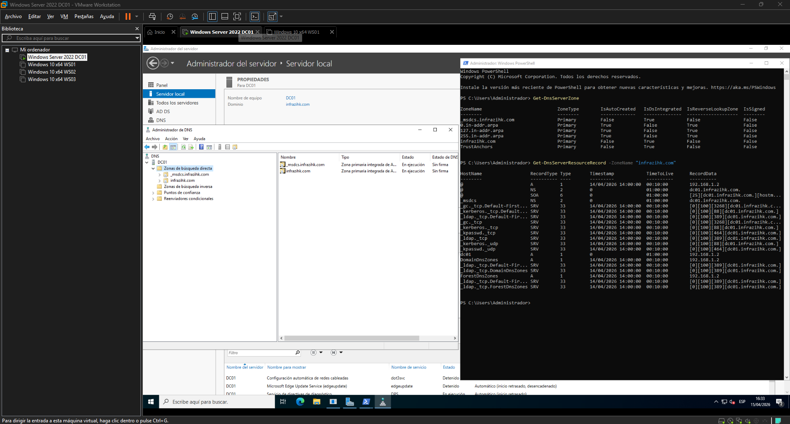
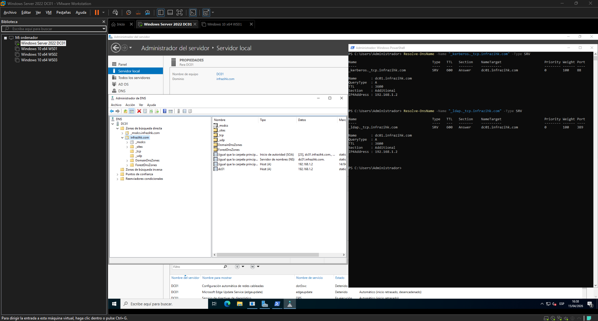
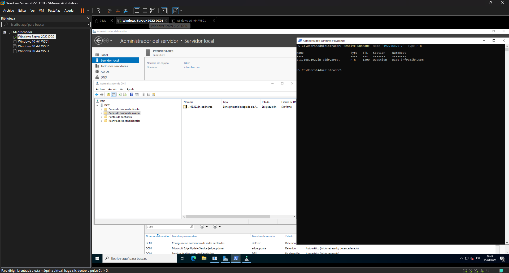
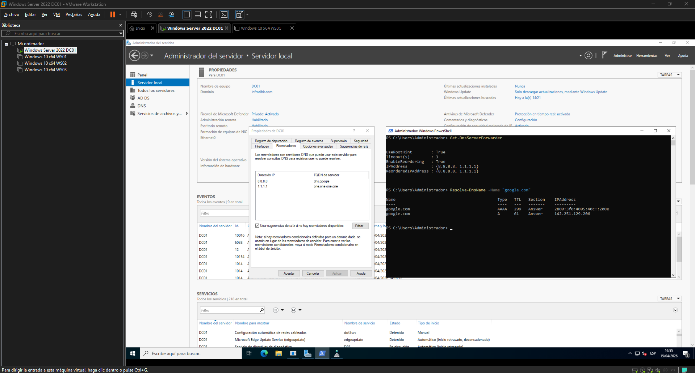
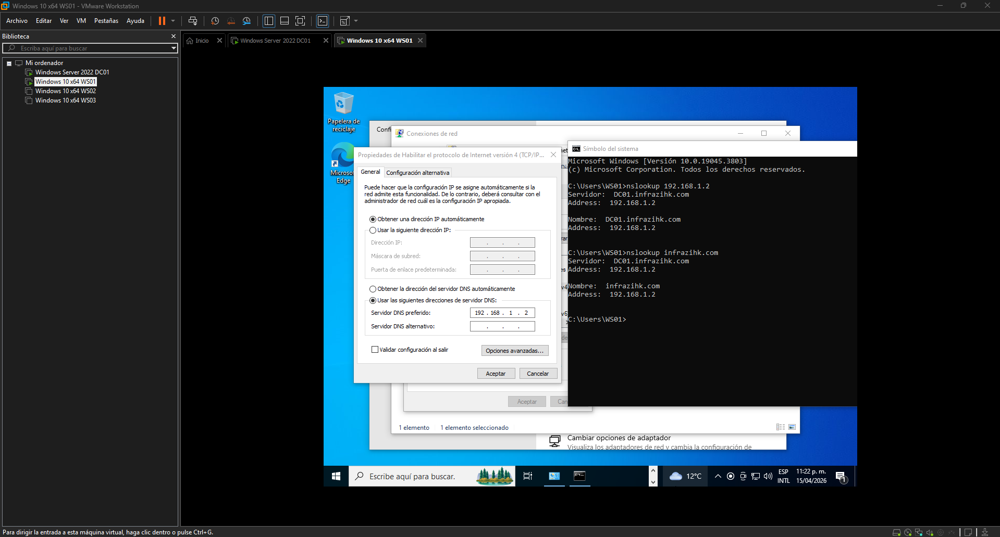
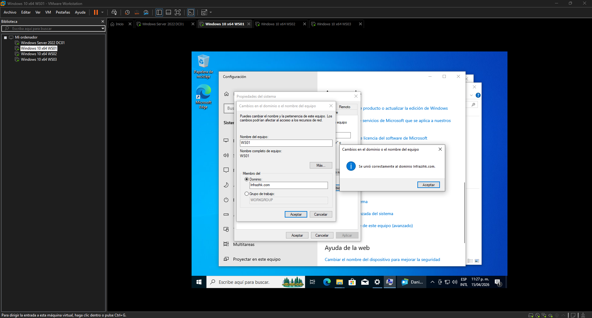
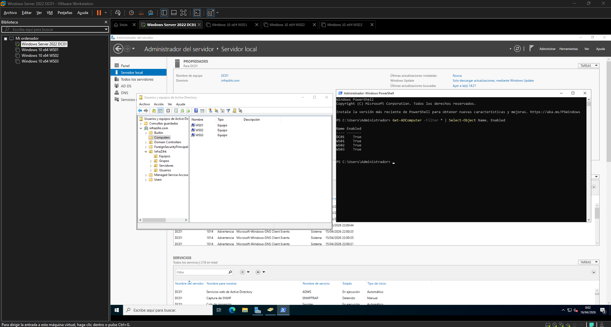
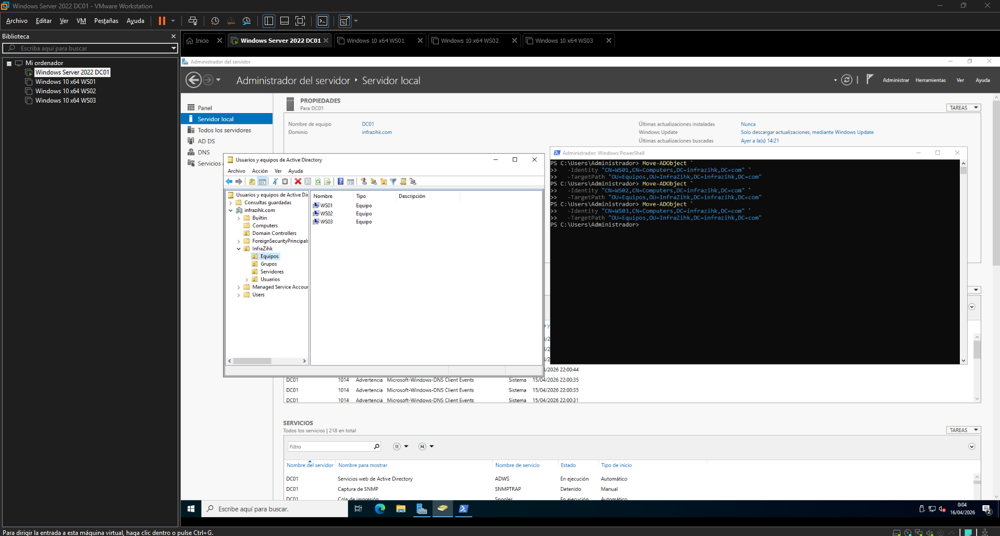
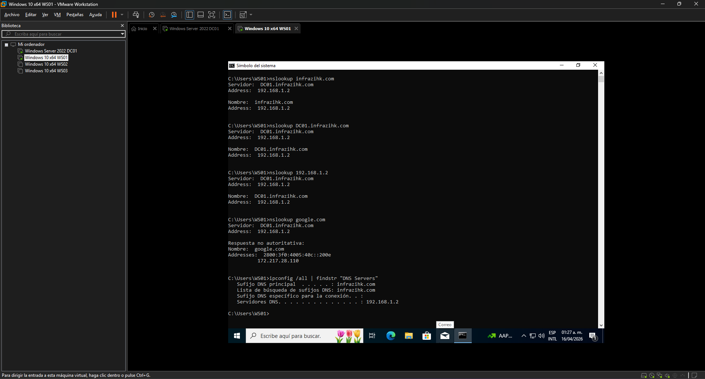

# Fase 2 Configuración de DNS e incorporación de clientes al dominio

## Objetivo

Verificar que el DNS integrado con AD esté funcionando correctamente, validar los registros que necesita el dominio, configurar reenviadores para resolución externa y unir los tres equipos cliente (WS01, WS02, WS03) al dominio `infrazihk.com`.

---

## ¿Por qué el DNS es tan importante aquí?

Active Directory no usa IPs para encontrar sus servicios usa DNS. Cuando un cliente quiere autenticarse, primero consulta el DNS para encontrar el controlador de dominio. Si el DNS falla, todo lo demás falla con él: login, GPOs, replicación.

AD registra automáticamente sus servicios en el DNS al momento de la promoción. Esta fase verifica que esos registros existan y que los clientes puedan usarlos.

---

## Paso 1 Verificar zonas DNS integradas con AD

Cuando se promovió DC01 en la [Fase 1](../01-instalacion-ad/README.MD), el instalador creó automáticamente la zona DNS `infrazihk.com` integrada en AD. Se debe confirmar que existe y está bien.

### 1.1 Desde DNS Manager

1. En DC01, abrir **Administrador de servidores → Herramientas → DNS**
2. Expandir `DC01 → Zonas de Búsqueda Directa`
3. Confirmar que existe la zona `infrazihk.com`
4. Dentro de esa zona, verificar que hay registros (no debe estar vacía)

### 1.2 Desde PowerShell

```powershell
# Ver todas las zonas DNS
Get-DnsServerZone

# Ver los registros dentro de la zona del dominio
Get-DnsServerResourceRecord -ZoneName "infrazihk.com"
```

Lo que se debe ver en la zona:

| Tipo | Nombre     | Significado                                                              |
| ---- | ---------- | ------------------------------------------------------------------------ |
| A    | dc01       | Asocia el nombre del servidor DC01 con su dirección IP (resolución DNS)  |
| NS   | @          | Define a DC01 como servidor DNS autoritativo de la zona                  |
| SOA  | @          | Indica el servidor principal de la zona (DNS)                            |
| SRV  | \_kerberos | Permite ubicar los controladores de dominio para autenticación segura    |
| SRV  | \_ldap     | Permite ubicar los controladores de dominio para consultas al directorio |

> Si los registros SRV no aparecen, el dominio no podrá autenticar usuarios.
> El comando para forzar su re-registro está en la sección de troubleshooting al final.



---

## Paso 2 Verificar registros SRV

Los registros SRV le dicen a los clientes dónde está el Domain Controller. Sin ellos, un equipo no puede unirse al dominio ni autenticar.

```powershell
# Verificar registros SRV de Kerberos
Resolve-DnsName -Name "_kerberos._tcp.infrazihk.com" -Type SRV

# Verificar registros SRV de LDAP
Resolve-DnsName -Name "_ldap._tcp.infrazihk.com" -Type SRV
```

Ambos deben responder con `DC01.infrazihk.com` como el servidor destino.



---

## Paso 3 Verificar zona de resolución inversa (PTR)

La zona inversa permite traducir una IP a un nombre (reverse lookup). Es útil para troubleshooting y también para auditoría.

### 3.1 Crear la zona inversa (si no existe)

1. En el **Administrador de DNS**, clic derecho en **Zonas de búsqueda inversa → Nueva Zona**
2. Tipo: **Zona principal** → marcar **Almacenar la zona en Active Directory**
3. Replicación: **A todos los servidores DNS que se ejecutan en los controladores de dominio en este dominio: infrazihk.com**
4. Ingresar el ID de red IPv4: `192.168.1`
5. Finalizar

### 3.2 Agregar registro PTR para DC01

```powershell
Add-DnsServerResourceRecordPtr `
  -ZoneName "1.168.192.in-addr.arpa" `
  -Name "2" `
  -PtrDomainName "DC01.infrazihk.com"
```

**Verificación:**

```powershell
Resolve-DnsName -Name "192.168.1.2" -Type PTR
```

Debe responder: `DC01.infrazihk.com`



---

## Paso 4 Configurar reenviadores DNS

Por defecto, DC01 no sabe resolver nombres de internet (google.com, etc.). Un reenviador le indica a qué DNS externo debe derivar esas consultas.

### 4.1 Desde DNS Manager

1. En el Administrador de DNS, clic derecho en `DC01 → Propiedades`
2. Ir a la pestaña **Reenviadores**
3. Clic en **Editar**
4. Agregar: `8.8.8.8` (Google) y `1.1.1.1` (Cloudflare)
5. Aceptar

> En entornos empresariales, los reenviadores suelen apuntar a DNS internos o del ISP, no necesariamente a DNS públicos.

### 4.2 Desde PowerShell

```powershell
Set-DnsServerForwarder -IPAddress "8.8.8.8","1.1.1.1"

# Verificar
Get-DnsServerForwarder
```

**Verificación:**

```powershell
# Desde DC01, resolver un nombre externo
Resolve-DnsName -Name "google.com"
```

Si responde con IPs, los reenviadores funcionan.



---

## Paso 5 Configurar DNS en los clientes antes de unirlos al dominio

Antes de unir WS01, WS02 y WS03 al dominio, cada uno debe apuntar su DNS al DC01. Si un cliente tiene el DNS del ISP o de DHCP apuntando a otro servidor, no va a encontrar `infrazihk.com` y la unión fallará.

Repetir en cada cliente (WS01, WS02, WS03):

1. Ir a **Panel de Control → Redes e Internet → Centro de redes y recursos compartidos → Cambiar configuración del adaptador**
2. Clic derecho en el adaptador → **Propiedades → IPv4 → Propiedades**
3. Configurar:

| Campo           | Valor                                                                        |
| --------------- | ---------------------------------------------------------------------------- |
| DNS preferido   | `192.168.1.2` (DC01)                                                         |
| DNS alternativo | _(vacío por ahora, DC02 se agrega en [Fase 4](../04-replicacion/README.MD))_ |

> IMPORTANTE:
> En el entorno con Directorio Activo, los clientes NO deben usar DNS externos directamente (como 8.8.8.8), ya que esto rompe la resolución del dominio. Siempre deben apuntar primero al controlador de dominio.

**Verificación desde cada cliente:**

```powershell
nslookup infrazihk.com
```

Debe responder con `192.168.1.2`. Si no resuelve, no seguir al paso 6.



---

## Paso 6 Unir WS01, WS02 y WS03 al dominio

Repetir el proceso en cada cliente.

### 6.1 Desde la interfaz gráfica

1. Clic derecho en **Este equipo → Propiedades**
2. Clic en **Cambiar el nombre a este equipo (avanzado)**
3. En la pestaña **Nombre del equipo**, clic en **Cambiar**
4. Seleccionar **Dominio** e ingresar: `infrazihk.com`
5. Cuando pida credenciales, ingresar las del administrador del dominio:
   - Usuario: `Administrador`
   - Contraseña: la que se configuró en la Fase 1
6. Aceptar y reiniciar

### 6.2 Desde PowerShell

```powershell
# Ejecutar en cada cliente
Add-Computer `
  -DomainName "infrazihk.com" `
  -Credential (Get-Credential) `
  -Restart
```

Cuando aparezca el prompt de credenciales, ingresar `Administrador`.



### 6.3 Verificar desde DC01 que los equipos se unieron

```powershell
Get-ADComputer -Filter * | Select-Object Name, Enabled
```

Deben aparecer WS01, WS02 y WS03 en la lista.

También en **Usuarios y equipos de Active Directory**, dentro del contenedor `Computers` del dominio, deben aparecer los tres equipos.

> Se pueden mover a la OU `Equipos` que se creo en la Fase 1:
>
> ```powershell
> Move-ADObject `
>   -Identity "CN=WS01,CN=Computers,DC=infrazihk,DC=com" `
>   -TargetPath "OU=Equipos,OU=InfraZihk,DC=infrazihk,DC=com"
> ```

---




## Paso 7 Verificación final del DNS desde los clientes

Con los clientes ya en el dominio, hacer estas pruebas desde cada uno:

```powershell
# Resolución del dominio
nslookup infrazihk.com

# Resolución del DC por nombre
nslookup dc01.infrazihk.com

# Resolución inversa (IP → nombre)
nslookup 192.168.1.2

# Resolución externa (confirma que los reenviadores funcionan)
nslookup google.com

# Ver qué servidor DNS está usando el cliente
ipconfig /all | findstr "DNS Servers"
```



---

## Troubleshooting

**Los registros SRV no aparecen en DNS:**

```powershell
# Forzar que el DC vuelva a registrar sus registros DNS
nltest /dsregdns
ipconfig /registerdns
Restart-Service -Name "Netlogon"
```

**El cliente no puede resolver `infrazihk.com`:**

```powershell
# Verificar que el DNS del cliente apunta a DC01
ipconfig /all

# Limpiar caché DNS del cliente
ipconfig /flushdns

# Probar conectividad básica con DC01
ping 192.168.1.2
```

**La unión al dominio falla con error de red:**

- Confirmar que el cliente tiene DNS apuntando a `192.168.1.2`
- Confirmar que `ping dc01.infrazihk.com` responde desde el cliente
- Verificar que DC01 está encendido y que el servicio de Netlogon este corriendo

**La unión al dominio falla con error de credenciales:**

- Usar `Administrador` (con el nombre NetBIOS del dominio)
- Verificar que la cuenta no está bloqueada en DC01

---

## Criterios de validación de esta fase

| Check                         | Comando                                              | Resultado esperado                |
| ----------------------------- | ---------------------------------------------------- | --------------------------------- |
| Zona DNS existe               | `Get-DnsServerZone`                                  | `infrazihk.com` tipo Primary      |
| Registros SRV OK              | `Resolve-DnsName _ldap._tcp.infrazihk.com -Type SRV` | Responde con `DC01.infrazihk.com` |
| Reenviadores activos          | `Get-DnsServerForwarder`                             | `8.8.8.8` y `1.1.1.1`             |
| Clientes resuelven el dominio | `nslookup infrazihk.com` (desde WS01/02/03)          | `192.168.1.2`                     |
| Equipos en el dominio         | `Get-ADComputer -Filter *` (desde DC01)              | WS01, WS02, WS03                  |
| Resolución externa funciona   | `nslookup google.com` (desde cliente)                | Responde con IPs                  |

---

## Navegación

| Anterior Fase                                                               | Siguiente Fase                                            |
| --------------------------------------------------------------------------- | --------------------------------------------------------- |
| [Instalación y promoción de AD DS ← Fase 1](../01-instalacion-ad/README.md) | [Fase 3 → Directivas de grupo (GPO)](../03-gpo/README.md) |
