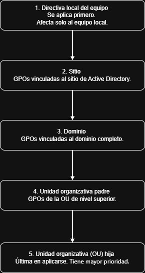
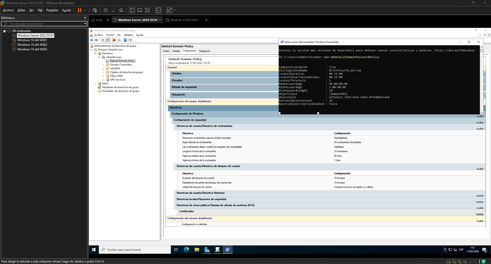
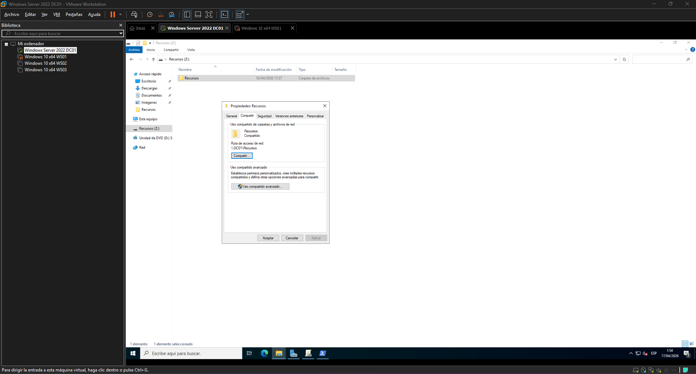
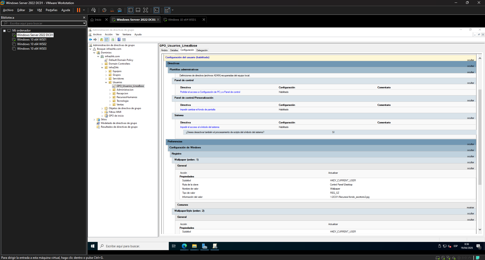
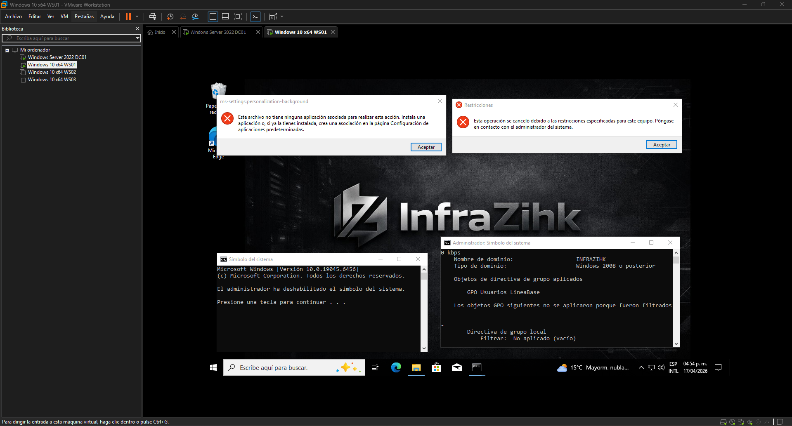
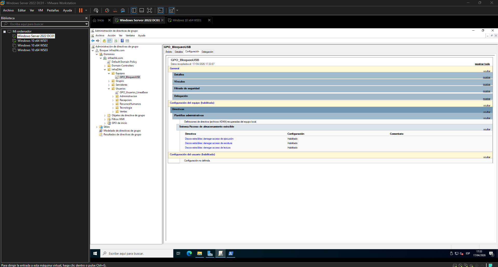
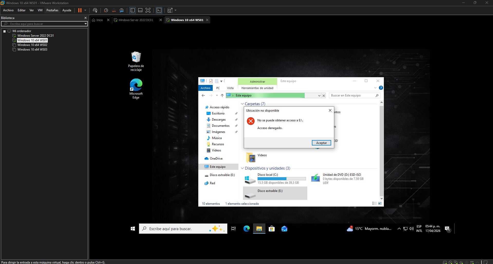

# Fase 3 Directivas de grupo (GPO)

## Objetivo

Reemplazar la configuración manual que se hace equipo por equipo con políticas centrales. En esta fase se crean cuatro GPOs que cubren las necesidades de seguridad de InfraZihk: política de contraseñas, fondo de escritorio, restricciones de seguridad como bloqueo del panel de control, cmd y bloqueo de dispositivos USB.

---

## ¿Qué es una GPO y cómo funciona?

Una Group Policy Object (GPO) es un conjunto de configuraciones que Windows aplica automáticamente a usuarios o equipos cuando inician sesión o arrancan.

El flujo es:

1. Se crea la GPO en DC01
2. Se vincula a una OU
3. Cada equipo o usuario dentro de esa OU recibe esa configuración automáticamente, sin tocar cada equipo

El orden en que se aplican las GPOs es:



Las GPO se aplican siguiendo el orden LSDOU (Local, Site, Domain, OU), donde las políticas más cercanas al objeto (usuario o equipo) tienen mayor prioridad.
Por este motivo, las GPO vinculadas a OUs pueden sobrescribir configuraciones definidas a nivel de dominio, salvo que una política esté marcada como Exigida (Enforced).

---

## Paso 1 GPO de contraseñas y bloqueo de cuenta

Esta GPO se aplica a todo el dominio. Define las reglas mínimas de seguridad para las contraseñas de todos los usuarios de InfraZihk.

> Esta GPO se aplica directamente al dominio (`infrazihk.com`), no a una OU, porque las políticas de contraseña solo funcionan si están configuradas a nivel de dominio.

### 1.1 Configurar la GPO

Como buena práctica, no se crean múltiples GPO para políticas de contraseñas. Active Directory ya incluye una política por defecto a nivel de dominio (Default Domain Policy), donde deben configurarse estas reglas. Si se requieren políticas diferentes para ciertos usuarios o roles, se deben utilizar Fine-Grained Password Policies en lugar de crear nuevas GPO.

> Esto aplica para la política base del dominio.

Configurar los valores desde la **Administración de directivas de grupo**:

1. Abrir la **Administración de directivas de grupo** (`gpmc.msc`) o también desde el Administrador del Servidor → Herramientas → Administración de directivas de grupo
2. Expandir `Bosque: infrazihk.com → Dominios → infrazihk.com`
3. Clic derecho en `Default Domain Policy → Editar`
4. Navegar a:
   `Configuración de equipo → Directivas → Configuración de Windows → Configuración de seguridad → Directivas de cuenta → Directiva de contraseñas`

| Configuración                                                | Valor recomendado           |
| ------------------------------------------------------------ | --------------------------- |
| Longitud mínima de la contraseña                             | `10` caracteres             |
| La contraseña debe cumplir con los requisitos de complejidad | `Habilitada`                |
| Edad máxima de la contraseña                                 | `90` días                   |
| Edad mínima de la contraseña                                 | `1` día                     |
| Exigir historial de contraseñas                              | `24` contraseñas recordadas |

5. Luego ir a `Directiva de bloqueo de cuenta`:

| Configuración                               | Valor recomendado     |
| ------------------------------------------- | --------------------- |
| Umbral del bloqueo de cuenta                | `5` intentos fallidos |
| Duración del bloqueo de cuenta              | `15` minutos          |
| Restablecer el bloqueo de cuenta después de | `15` minutos          |

> **¿Por qué estos valores?**
>
> - **10 caracteres mínimos:** Para este laboratorio es un valor aceptable y funcional. En entornos reales se recomienda entre 12 y 16 caracteres mínimos.
> - **Complejidad habilitada:** Obliga a que la contraseña combine mayúsculas, minúsculas, números y al menos un carácter especial, reduciendo significativamente la posibilidad de ataques de fuerza bruta o diccionario.
> - **90 días de edad máxima:** Es un tiempo prudente para forzar la rotación de contraseñas sin generar problemas en los usuarios.
> - **1 día de edad mínima:** Evita que un usuario cambie su contraseña repetidamente en el mismo día solo para volver a su contraseña anterior, burlando el historial.
> - **24 contraseñas en el historial:** Un número alto que garantiza que el usuario no pueda volver a usar contraseñas recientes, complementando directamente la política de rotación cada 90 días.
> - **5 intentos antes del bloqueo:** Balance entre seguridad y usabilidad. Es suficientemente bajo para detener ataques automatizados y suficientemente alto para tolerar los errores humanos normales.
> - **15 minutos de bloqueo:** Es un tiempo prudente que disuade ataques sin generar una carga alta para el equipo de soporte, ya que el bloqueo se libera solo sin necesidad de intervención de un administrador.

### 1.2 Verificación

```powershell
# Ver la política de contraseñas activa en el dominio
Get-ADDefaultDomainPasswordPolicy

# Forzar aplicación inmediata en DC01
gpupdate /force
```



---

## Paso 2 GPO de usuarios (Línea Base)

Esta GPO establece la configuración base del entorno de los usuarios del dominio, incluyendo la personalización del escritorio y restricciones visuales básicas.

### 2.1 Preparar la imagen del fondo

La imagen debe estar en una ruta de red accesible por todos los equipos. Lo más simple es compartir una carpeta en DC01.



Copiar el archivo del fondo (por ejemplo `fondo_escritorio.png`) dentro de esa carpeta. La ruta de red quedará como: `\\DC01\Recursos\fondo_escritorio.png`

### 2.2 Crear y vincular la GPO

```powershell
New-GPO -Name "GPO_Usuarios_LineaBase" | `
  New-GPLink -Target "OU=Usuarios,OU=InfraZihk,DC=infrazihk,DC=com"
```

### 2.3 Configuración de la GPO

En la **Administración de directivas de grupo**:

> **Por qué NO usar Active Desktop:**
> En el editor de GPO existe la ruta `Configuración de usuarios → Directivas → Plantillas administrativas → Active Desktop → Active Desktop`, pero **no funciona en Windows 10/11**. Active Desktop fue descontinuado desde Windows Vista. Si se habilita esa directiva en equipos actuales, el fondo de pantalla no carga y el escritorio muestra un color sólido. El método correcto para entornos actuales es mediante **Preferencias de Registro**, tal como se documenta a continuación.

El fondo de escritorio se configura mediante preferencias de registro directamente en `HKEY_CURRENT_USER\Control Panel\Desktop`, que es el método compatible con Windows 10 y Windows 11.

1. Navegar a:
   `Configuración de usuario → Preferencias → Configuración de Windows → Registro`
2. Clic derecho → **Nuevo → Elemento del Registro**
3. Crear las siguientes 3 entradas:

| Acción     | Subárbol          | Ruta de clave           | Nombre de valor  | Tipo   | Datos                                  |
| ---------- | ----------------- | ----------------------- | ---------------- | ------ | -------------------------------------- |
| Actualizar | HKEY_CURRENT_USER | `Control Panel\Desktop` | `Wallpaper`      | REG_SZ | `\\DC01\Recursos\fondo_escritorio.jpg` |
| Actualizar | HKEY_CURRENT_USER | `Control Panel\Desktop` | `WallpaperStyle` | REG_SZ | `10` (Fill / Rellenar)                 |
| Actualizar | HKEY_CURRENT_USER | `Control Panel\Desktop` | `TileWallpaper`  | REG_SZ | `0`                                    |

> `WallpaperStyle` acepta los valores: `2` = Ajustar, `6` = Ajustar al tamaño, `10` = Rellenar, `22` = Expandir.

## Para evitar que el usuario cambie el fondo:

En la **Administración de directivas de grupo**:

5. Navegar a:
   `Configuración de usuarios → Directivas → Plantillas administrativas → Panel de control → Personalización `
6. Activar **Impedir cambiar el fondo de pantalla** → `Habilitado`

## Deshabilitar Panel de Control para usuarios estándar:

En la **Administración de directivas de grupo**:

7. Navegar a:
   `Configuración de usuario → Directivas → Plantillas administrativas → Panel de control`
8. Activar **Prohibir el acceso a Configuración del PC y a Panel de control.** → `Habilitado`

## Deshabilitar CMD para usuarios estándar

9. Navegar a:
   `Configuración de usuario → Directivas → Plantillas administrativas → Sistema`
10. Activar **Impedir el acceso al símbolo del sistema.** → `Habilitado`

- Marcar también: **Deshabilitar también el procesamiento de scripts del símbolo del sistema**

> Esta restricción aplica a usuarios estándar. Los administradores del dominio no se ven afectados porque sus cuentas tienen privilegios que sobreescriben las restricciones de GPO.

### 2.4 Verificación

```powershell
gpupdate /force
```

Cerrar sesión y volver a entrar. El fondo corporativo debe aparecer sin opción de cambiarlo.

```powershell
gpresult /USER infrazihk\jdavid /r
```

En la salida de `gpresult /USER infrazihk\jdavid /r` debe aparecer `GPO_Usuarios_LineaBase`
bajo **Objetos de directiva de grupo aplicados**.




---

## Paso 3 GPO de bloqueo de USB

Esta GPO evita que los usuarios conecten dispositivos de almacenamiento USB. Es una de las medidas más efectivas contra perdida de la información o introducción de malware.

```powershell
New-GPO -Name "GPO_BloqueoUSB" | `
  New-GPLink -Target "OU=Equipos,OU=InfraZihk,DC=infrazihk,DC=com"
```

En la **Administración de directivas de grupo**:

1. Navegar a:
   `Configuración del equipo → Directivas → Plantillas administrativas → Sistema → Acceso al almacenamiento extraíble`
2. Configurar:

| Configuración                                  | Valor        |
| ---------------------------------------------- | ------------ |
| Discos extraíbles: Denegar acceso de lectura   | `Habilitado` |
| Discos extraíbles: Denegar acceso de escritura | `Habilitado` |
| Discos extraíbles: Denegar acceso de ejecución | `Habilitado` |

> Estas configuraciones aplican a nivel de equipo, por lo que requieren reinicio para su correcta aplicación.

### Verificación

1. Conectar un USB en WS01 con el usuario estándar
2. El sistema no debe dejar utilizar el almacenamiento externo
3. Confirmar desde PowerShell: `gpresult /USER infrazihk\jdavid /r`




---

## Paso 4 Verificación general de todas las GPOs

### Ver todas las GPOs del dominio

```powershell
Get-GPO -All | Select-Object DisplayName, GpoStatus, CreationTime
```

### Ver a qué OUs está vinculada cada GPO

```powershell
Get-GPOReport -All -ReportType HTML -Path "C:\gpo-report.html"
# Abrir C:\gpo-report.html en el navegador para ver el reporte completo
```

### Verificar GPOs aplicadas desde un cliente

```powershell
# Resumen rápido (usuario y equipo)
gpresult /USER infrazihk\jdavid /r

# Reporte detallado en HTML
gpresult /H C:\gpresult-ws01.html
```

En la sección **Objetos de directiva de grupo aplicados** deben aparecer todas las GPOs
vinculadas a las OUs donde está el equipo y el usuario.

---

## Troubleshooting

**La GPO aparece en `gpresult /USER infrazihk\jdavid /r` pero no se aplica visualmente:**

```powershell
# Limpiar caché de políticas y forzar reaplicación
gpupdate /force /boot   # Si requiere reinicio
secedit /refreshpolicy machine_policy /enforce
```

**La GPO no aparece en `gpresult /USER infrazihk\jdavid /r`:**

1. Verificar que el equipo está en la OU correcta desde ADUC
2. Verificar que la GPO está vinculada y habilitada en `gpmc.msc`
3. Confirmar que no hay un **Filtrado de seguridad** que excluya al equipo

```powershell
# Ver a qué OU pertenece el equipo
Get-ADComputer -Identity "WS01" | Select-Object DistinguishedName
```

**El fondo no cambia después de `gpupdate /force`:**

4. Cerrar sesión y volver a iniciarla (algunas configuraciones de usuario
   requieren re-logon, no solo gpupdate)
5. Verificar que la ruta del fondo de pantalla es accesible desde el cliente:

```powershell
Test-Path "\\DC01\Recursos\fondo_escritorio.jpg"
```

**La restricción de USB no funciona:**

6. Confirmar que la GPO está en `Configuración del equipo`, no en `Configuración de usuario`
7. Las políticas de equipo requieren reinicio, no solo gpupdate

---

## Criterios de validación de esta fase

| Check                            | Cómo verificar                                | Resultado esperado                        |
| -------------------------------- | --------------------------------------------- | ----------------------------------------- |
| Política de contraseñas activa   | `Get-ADDefaultDomainPasswordPolicy`           | Min 10 caracteres, complejidad habilitada |
| Bloqueo de cuenta activo         | Misma salida anterior                         | Bloqueo en 5 intentos                     |
| Fondo corporativo aplicado       | Iniciar sesión en WS01/02/03                  | Fondo corporativo, sin opción de cambio   |
| Panel de Control o CMD bloqueado | Intentar abrir Panel de Control o CMD en WS01 | Acceso denegado                           |
| USB bloqueado                    | Conectar USB en WS01 con usuario estándar     | Error de acceso denegado                  |
| GPOs visibles en cliente         | `gpresult /USER infrazihk\jdavid /r` en WS01  | 2 GPOs                                    |

---

## Navegación

| Anterior Fase                                                                               | Siguiente Fase                                                   |
| ------------------------------------------------------------------------------------------- | ---------------------------------------------------------------- |
| [Configuración de DNS e incorporación de clientes al dominio ← Fase 2](../02-dns/README.md) | [Fase 4 → Segundo DC y replicación](../04-replicacion/README.md) |
